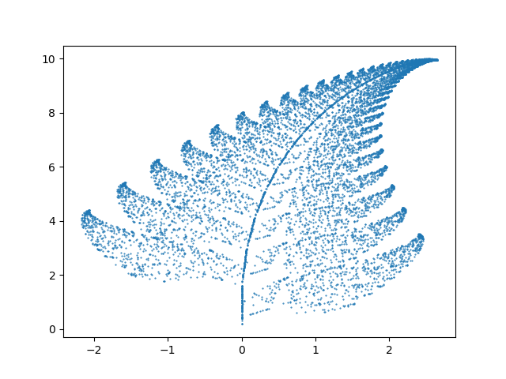

# Barnsley Fern

On a yucky winter morning, I decided to produce Barnsley fern images.

This builds on the template code from my repo cpp-pyplot [now deleted, use cplotlib instead] to allow access to MatPlotLib through C++.

The rest of the code for this repo was only written by referencing: https://en.wikipedia.org/wiki/Barnsley_fern

## Requirements

- CMake
- Python3
- Matplotlib

## Function Tables

The classic ferns are produced by a table of values:

w | a | b | c | d | e | f | p | Portion generated
--- | --- | --- | --- |--- |--- |--- |--- |---
f1 | 0 | 0 | 0 | 0.16 | 0 | 0 | 0.01 | Stem
f2 | 0.85 | 0.04 | −0.04 | 0.85 | 0 | 1.60 | 0.85 | Successively smaller leaflets
f3 | 0.20 | −0.26 | 0.23 | 0.22 | 0 | 1.60 | 0.07 | Largest left-hand leaflet
f4 | −0.15 | 0.28 | 0.26 | 0.24 | 0 | 0.44 | 0.07 | Largest right-hand leaflet 

The f1 - f4 variables in main.cpp are modifiable tables, they allow the user to experiment with fern generation.

The loop that does the generation is written such that f1[a] is used to reference elements of the table rather than f1[0] to make it easier to understand which parts of the table govern which process.
